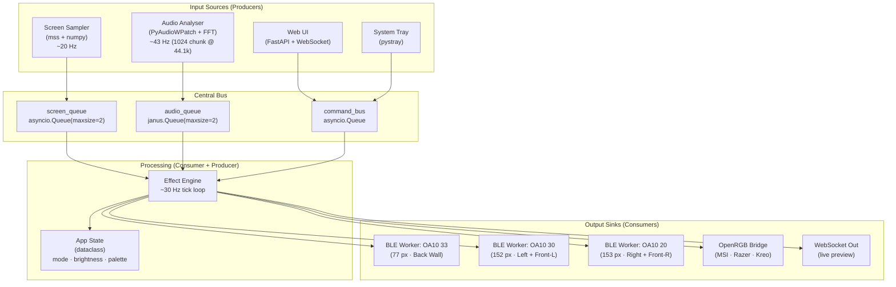
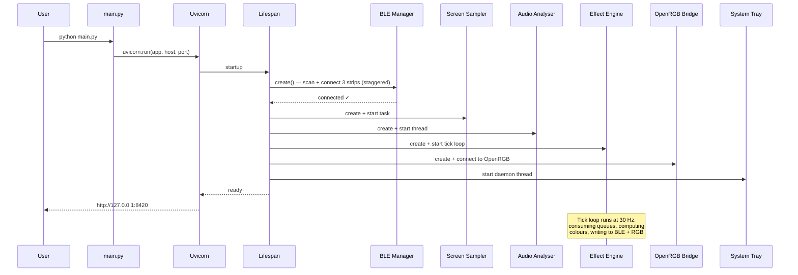

# RoomLights — Software Architecture Document

> **Purpose**: A flawless, step-by-step architectural blueprint and logic flow for a continuous Python-based controller that synchronizes three MELK-OA10 BLE LED strips with PC screen content, desktop audio, and peripherals.

---

## 1. Tech Stack Selection

### Core Runtime

| Layer | Library | Version / Notes |
|:---|:---|:---|
| **Async Runtime** | `asyncio` (stdlib) | Single event loop owns everything. **Never** call `asyncio.run()` more than once. |
| **BLE Transport** | `bleak` | Pure-Python, async-native GATT client. |
| **BLE Robustness** | `bleak-retry-connector` | Automatic exponential-backoff retry + GATT service caching via `BleakClientWithServiceCache`. |
| **Screen Capture** | `mss` | Native GDI screen grab; ~60 FPS on 1080p. Reuse a single `mss.mss()` instance. |
| **Image Math** | `numpy` | Vectorised mean-colour, region slicing, sub-sampling (`img[::10,::10]`). |
| **Audio Capture** | `PyAudioWPatch` | Patched PyAudio fork that exposes WASAPI loopback devices on Windows as virtual inputs. |
| **FFT / DSP** | `numpy.fft` + `scipy.signal` | `rfft` for frequency magnitudes; Hann windowing; band-pass via `scipy.signal.butter`/`sosfilt`. |
| **Peripheral Bridge** | `openrgb-python` | Connects to the OpenRGB Network Server (port 6742) to unify MSI / Razer / Kreo devices. |
| **Web UI** | `FastAPI` + `Uvicorn` | ASGI server shares the main `asyncio` loop. WebSocket for live previews. |
| **System Tray** | `pystray` + `Pillow` | Optional lightweight tray icon; runs in a daemon thread, posts commands back to the async loop. |
| **Config** | `pydantic-settings` + `toml` | Validated config model (`config.toml` file + env overrides). |
| **Logging** | `structlog` | JSON-structured, async-safe. |

### Dependency Graph

```
asyncio (event loop) ─┬─ FastAPI / Uvicorn  (HTTP + WS)
                      ├─ BLE Manager        (bleak + retry-connector)
                      ├─ Screen Sampler     (mss + numpy)
                      ├─ Audio Analyser     (PyAudioWPatch + numpy/scipy)
                      ├─ Peripheral Bridge  (openrgb-python)
                      └─ Effect Engine      (pure Python / numpy)
```

---

## 2. Threading / Async Strategy

### 2.1 Golden Rule — One Event Loop

Uvicorn creates the `asyncio` event loop on the **main thread**. Every subsystem must be an `asyncio.Task` on that loop or, if unavoidably blocking, be offloaded to a thread-pool executor.

### 2.2 Subsystem Ownership Table

| Subsystem | Runs On | Reason |
|:---|:---|:---|
| BLE Writer × 3 | `asyncio.Task` on main loop | `bleak` is `async`-native; GATT writes are I/O-bound. |
| Screen Sampler | `asyncio.Task` → `loop.run_in_executor(ThreadPool)` | `mss.grab()` is a blocking C call (~2–5 ms). |
| Audio Analyser | Dedicated `threading.Thread` | `PyAudioWPatch` stream callbacks are synchronous. The thread writes results into a `janus.Queue` (thread→async bridge). |
| OpenRGB Bridge | `asyncio.Task` → `loop.run_in_executor(ThreadPool)` | `openrgb-python` SDK is synchronous (socket I/O). |
| FastAPI | Main loop (Uvicorn) | Native ASGI; never blocked if async handlers are used. |
| System Tray | `threading.Thread` (daemon) | `pystray` runs its own Win32 message pump. Sends commands via `asyncio.run_coroutine_threadsafe()`. |

### 2.3 Lifecycle Management (FastAPI Lifespan)

All background tasks are started/stopped via FastAPI's `@asynccontextmanager` lifespan hook. This guarantees clean shutdown of BLE connections and audio streams.

```
@asynccontextmanager
async def lifespan(app):
    # ── STARTUP ──
    ble_mgr    = await BLEManager.create(STRIP_CONFIGS)
    screen     = ScreenSampler()
    audio      = AudioAnalyser()
    fx_engine  = EffectEngine(ble_mgr, screen, audio)
    rgb_bridge = OpenRGBBridge()

    task_set = set()
    for coro in [ble_mgr.run(), screen.run(), audio.run(),
                 fx_engine.run(), rgb_bridge.run()]:
        t = asyncio.create_task(coro)
        task_set.add(t)
        t.add_done_callback(task_set.discard)

    app.state.engine = fx_engine   # expose to routes

    yield

    # ── SHUTDOWN ──
    for t in task_set:
        t.cancel()
    await asyncio.gather(*task_set, return_exceptions=True)
    await ble_mgr.disconnect_all()
```

### 2.4 Windows BLE Driver Stability

> [!WARNING]
> Consumer BT 4.0/4.2 adapters become unstable beyond 3–5 simultaneous connections. Since this project uses exactly 3 strips, you are at the limit. Use a **Bluetooth 5.0+ USB adapter** for reliability.

Mitigations:
1. **Scan before connect.** Use `BleakScanner.find_device_by_address()` to obtain a fresh `BLEDevice` handle before each `establish_connection()` call. Never connect by raw MAC string.
2. **Service caching.** `BleakClientWithServiceCache` skips GATT re-discovery on reconnect, cutting reconnect time by ~70%.
3. **Exponential-backoff retry.** `bleak-retry-connector.establish_connection(max_attempts=5)`.
4. **Staggered connection.** Connect strips sequentially (not `gather`) with a 500 ms gap to avoid flooding the adapter.
5. **Disconnect watchdog.** Each `BLEStripWorker` registers a `disconnected_callback` that triggers a reconnect coroutine.

### 2.5 Write Throttling (Critical)

The MELK-OA10 firmware cannot absorb writes faster than ~30 Hz. Beyond that, the BLE stack queues writes and eventually the connection drops.

**Strategy:** Each `BLEStripWorker` maintains a `_last_write_ts` timestamp. A guard skips any write attempt that arrives within the minimum interval:

```
MIN_WRITE_INTERVAL = 1 / 30   # 33 ms

async def write_color(self, r, g, b):
    now = time.monotonic()
    if now - self._last_write_ts < MIN_WRITE_INTERVAL:
        return  # skip — firmware can't keep up
    payload = bytes([0x7E, 0x07, 0x05, 0x03, r, g, b, 0x10, 0xEF])
    await self._client.write_gatt_char(WRITE_UUID, payload, response=False)
    self._last_write_ts = now
```

> Using `response=False` (write-without-response) is mandatory for low-latency; the firmware ignores the GATT response anyway.

---

## 3. Topology Math — Spatial Mapping & Effect Propagation

### 3.1 Physical Layout (Bird's-Eye View)

```
                    BACK WALL
    ╔══════════════════╤══════════════╗
    ║  ←── Strip 30 ───┤── Strip 33 →║ ← origin (center-right)
    ║                  │             ║
    ║                  │  Strip 20   ║
    ║  Strip 30        │     ↓       ║
    ║     ↓            │             ║
    ║                  │             ║
    ╠──────────────────┼─────────────╣
    ║  Strip 30 (end)  │ Strip 20    ║
    ║         ↘        │    ↙        ║
    ║           FRONT WALL CENTER    ║
    ╚════════════════════════════════╝
    LEFT WALL                 RIGHT WALL
```

### 3.2 Unified Linear Coordinate System

To compute spatial effects, we flatten the horseshoe into a single **normalised axis** `t ∈ [0.0, 1.0]`.

The path is traversed **counter-clockwise** starting from the shared origin at center-right of the Back Wall:

```
      Strip 33 (right-to-left)    Strip 30 (continuing left→down→right)
      ─────────────────────────►  ──────────────────────────────────────►
      t=0.0                       t=0.2016                           t=0.5992
         (origin, back wall CR)      (back wall left end)              (front wall center)

                                  Strip 20 (origin→right→down→left)
                              ◄──────────────────────────────────────
                              t=1.0                              t=0.5992
                                 (back wall CR, same origin)       (front wall center)
```

| Strip | Pixel Count | Normalised Span | `t_start` | `t_end` |
|:---|---:|:---|---:|---:|
| **OA10 33** | 77 | 77 / 382 = 0.2016 | 0.0000 | 0.2016 |
| **OA10 30** | 152 | 152 / 382 = 0.3979 | 0.2016 | 0.5995 |
| **OA10 20** | 153 | 153 / 382 = 0.4005 | 0.5995 | 1.0000 |

**Total virtual pixels: 77 + 152 + 153 = 382**

> [!IMPORTANT]
> Strip 20 runs in the **reverse** physical direction (from origin → right → front wall center), but on the normalised axis it occupies the **last** segment. Effects that "flow clockwise" thus see Strip 20 at the end of the `t` range, which maps to the physical right side of the room.

### 3.3 Effect: Travelling Pulse

A "pulse" is a Gaussian envelope that slides along the normalised axis over time.

**Parameters:**
- `speed` — pulses per second traversing the full ring (`1.0` = 1 complete lap/sec)
- `width` — σ of the Gaussian in normalised units (e.g., `0.08` ≈ 30 px)
- `base_color` — (R, G, B) of the resting state
- `pulse_color` — (R, G, B) at the peak of the pulse

**Per-frame computation (runs at effect engine tick rate, ~30 Hz):**

```
def compute_pulse(t_strip, time_s, speed, width, base_color, pulse_color):
    """
    t_strip   : float in [0, 1], the strip's midpoint on the unified axis
    time_s    : monotonic time in seconds
    speed     : laps per second
    width     : Gaussian sigma (normalised)
    base_color: (R, G, B)
    pulse_color: (R, G, B)
    Returns   : (R, G, B) for this strip at this instant
    """
    # Position of pulse peak, wrapping [0, 1)
    pulse_pos = (time_s * speed) % 1.0

    # Toroidal (wrapping) distance — handles the gap between t≈1.0 and t≈0.0
    delta = abs(t_strip - pulse_pos)
    delta = min(delta, 1.0 - delta)

    # Gaussian intensity  (peaks at 1.0 when delta=0)
    intensity = exp(-(delta ** 2) / (2 * width ** 2))

    # Lerp between base and pulse colour
    r = int(base_color[0] + (pulse_color[0] - base_color[0]) * intensity)
    g = int(base_color[1] + (pulse_color[1] - base_color[1]) * intensity)
    b = int(base_color[2] + (pulse_color[2] - base_color[2]) * intensity)

    return (clamp(r, 0, 255), clamp(g, 0, 255), clamp(b, 0, 255))
```

**Per tick, the engine calls this for each strip's midpoint:**

```
STRIP_MIDPOINTS = {
    "OA10 33": 0.1008,   # midpoint of [0.0000, 0.2016]
    "OA10 30": 0.4006,   # midpoint of [0.2016, 0.5995]
    "OA10 20": 0.7998,   # midpoint of [0.5995, 1.0000]
}

for name, t_mid in STRIP_MIDPOINTS.items():
    color = compute_pulse(t_mid, now, speed, width, base, pulse)
    await ble_mgr.set_color(name, *color)
```

### 3.4 Effect: Travelling Wave (Rainbow / Gradient Sweep)

A wave maps a **colour gradient** across the full normalised axis and scrolls it over time.

```
def compute_wave(t_strip, time_s, speed, palette):
    """
    palette : list of (R, G, B) forming a looping gradient (e.g. 256 entries)
    """
    # Phase = how far along the palette this strip is, scrolled by time
    phase = (t_strip + time_s * speed) % 1.0
    index = int(phase * (len(palette) - 1))
    return palette[index]
```

This naturally produces a continuous rainbow/gradient that appears to flow around the horseshoe because the spatial positions are encoded in `t_strip`.

### 3.5 Effect: Audio-Reactive Frequency Split

Map frequency bands to spatial zones of the horseshoe:

| Frequency Band | Range | Mapped Strip | Physical Zone | Rationale |
|:---|:---|:---|:---|:---|
| **Bass** (lows) | 20–250 Hz | OA10 33 (Back Wall) | Behind the user | Bass is omnidirectional; placing it behind creates an immersive "thump" |
| **Mids** | 250–4000 Hz | OA10 30 (Left Wall + Front-Left) | Wrapping side | Vocals/melodies sweep the periphery |
| **Highs** (treble) | 4000–20000 Hz | OA10 20 (Right Wall + Front-Right) | Opposite periphery | Hi-hats / cymbals sparkle on the other side |

**Magnitude-to-colour mapping:**

```
def freq_band_to_color(magnitude, band):
    """
    magnitude : float 0.0–1.0 (normalised from FFT bin average)
    band      : 'bass' | 'mids' | 'highs'
    """
    BAND_HUES = {'bass': 0, 'mids': 120, 'highs': 240}  # red, green, blue
    h = BAND_HUES[band]
    s = 1.0
    v = magnitude  # brightness tracks volume

    return hsv_to_rgb(h / 360, s, v)  # → (R, G, B) in 0–255
```

### 3.6 Effect: Screen Sync — Region Mapping

Each strip maps to a **screen edge region**:

```
┌─────────────────────────────┐
│          TOP (ignored)      │
│ ┌─────────────────────────┐ │
│ │                         │ │
│L│       MONITOR           │R│  ← Sample vertical strips (5% width)
│E│                         │I│
│F│                         │G│
│T│                         │H│
│ │                         │T│
│ └─────────────────────────┘ │
│         BOTTOM              │  ← Sample horizontal strip (10% height)
└─────────────────────────────┘
```

| Screen Region | Sampled Area | Mapped Strip |
|:---|:---|:---|
| **Left edge** (5% width × full height) | `img[:, 0:W*0.05]` | OA10 30 (left wall) |
| **Right edge** (5% width × full height) | `img[:, W*0.95:]` | OA10 20 (right wall) |
| **Bottom edge** (full width × 10% height) | `img[H*0.9:, :]` | OA10 33 (back wall, behind monitor) |

**Multi-monitor detection:**

```
with mss.mss() as sct:
    monitors = sct.monitors[1:]   # skip index 0 (virtual "all")
    if len(monitors) == 1:
        regions = single_monitor_regions(monitors[0])
    else:
        # Stitch monitors left-to-right; treat as one wide canvas
        combined_w = sum(m['width'] for m in monitors)
        regions = multi_monitor_regions(monitors, combined_w)
```

For each region, the colour is computed as:

```
subsampled = region_pixels[::10, ::10]        # every 10th pixel
avg_color  = subsampled.mean(axis=(0, 1))     # vectorised mean → (R, G, B)
```

---

## 4. Data Flow Architecture

### 4.1 High-Level Data Flow Diagram



### 4.2 Queue Contracts

| Queue | Type | maxsize | Item Schema | Notes |
|:---|:---|---:|:---|:---|
| `screen_queue` | `asyncio.Queue` | 2 | `ScreenFrame(left_rgb, right_rgb, bottom_rgb, ts)` | Named tuple. Old frames are dropped (`queue.put_nowait` wrapped in try/except `QueueFull` → pop-and-put). |
| `audio_queue` | `janus.Queue` | 2 | `AudioFrame(bass, mids, highs, ts)` | `janus` provides a sync `.put()` on the thread side and an `async .get()` on the asyncio side. |
| `command_bus` | `asyncio.Queue` | 0 (unbounded) | `Command(type, payload)` | Commands: `SET_MODE`, `SET_BRIGHTNESS`, `SET_PALETTE`, `SET_SPEED`, `POWER_OFF`, `POWER_ON`. |

### 4.3 Effect Engine — Tick Loop (Core Scheduler)

The Effect Engine is the single point of truth. It runs a fixed-rate loop that:

1. **Drains inputs** (non-blocking `get_nowait` from each queue).
2. **Applies the current mode's algorithm** to compute one `(R,G,B)` per strip.
3. **Fans out** the three colours to the BLE workers + OpenRGB bridge + WebSocket.

```
TICK_HZ = 30
TICK_INTERVAL = 1 / TICK_HZ

async def run(self):
    while True:
        tick_start = time.monotonic()

        # 1. Drain inputs
        screen = drain_latest(self.screen_queue)   # keeps only newest
        audio  = drain_latest(self.audio_queue)
        cmds   = drain_all(self.command_bus)
        for cmd in cmds:
            self.apply_command(cmd)

        # 2. Compute per-strip colours
        colors = {}
        match self.state.mode:
            case Mode.STATIC:
                colors = self.compute_static()
            case Mode.SCREEN_SYNC:
                colors = self.compute_screen_sync(screen)
            case Mode.AUDIO_REACTIVE:
                colors = self.compute_audio_reactive(audio)
            case Mode.PULSE:
                colors = self.compute_pulse(tick_start)
            case Mode.WAVE:
                colors = self.compute_wave(tick_start)
            case Mode.AMBIENT:
                colors = self.compute_ambient(screen, audio)

        # 3. Apply global brightness
        colors = {k: apply_brightness(v, self.state.brightness)
                  for k, v in colors.items()}

        # 4. Fan out
        for strip_name, (r, g, b) in colors.items():
            await self.ble_mgr.set_color(strip_name, r, g, b)

        if self.rgb_bridge:
            await self.rgb_bridge.set_unified_color(
                dominant_color(colors))

        if self.ws_clients:
            await self.broadcast_ws(colors)

        # 5. Sleep remainder of tick
        elapsed = time.monotonic() - tick_start
        await asyncio.sleep(max(0, TICK_INTERVAL - elapsed))
```

### 4.4 Screen Sampler — Producer Coroutine

```
async def run(self):
    loop = asyncio.get_running_loop()
    sct = mss.mss()  # reuse instance
    while True:
        frame = await loop.run_in_executor(
            self._thread_pool,
            self._capture_and_compute, sct
        )
        try:
            self.screen_queue.put_nowait(frame)
        except asyncio.QueueFull:
            self.screen_queue.get_nowait()  # drop oldest
            self.screen_queue.put_nowait(frame)
        await asyncio.sleep(1 / 20)  # target 20 Hz
```

### 4.5 Audio Analyser — Dedicated Thread

```
class AudioAnalyser(threading.Thread):
    def __init__(self, janus_queue):
        super().__init__(daemon=True)
        self._q = janus_queue.sync_q   # synchronous side

    def run(self):
        p = pyaudio.PyAudio()
        loopback = find_wasapi_loopback(p)
        stream = p.open(format=pyaudio.paFloat32,
                        channels=loopback['maxInputChannels'],
                        rate=int(loopback['defaultSampleRate']),
                        input=True,
                        input_device_index=loopback['index'],
                        frames_per_buffer=1024)
        while True:
            data = np.frombuffer(stream.read(1024, exception_on_overflow=False),
                                 dtype=np.float32)
            # Mono mixdown
            if data.ndim > 1:
                data = data.mean(axis=1)
            # Hann window + FFT
            windowed = data * np.hanning(len(data))
            fft_mag  = np.abs(np.fft.rfft(windowed))
            # Bin into bands (indices depend on sample rate)
            sr = int(loopback['defaultSampleRate'])
            bass = fft_mag[freq_to_bin(20,sr,1024):freq_to_bin(250,sr,1024)].mean()
            mids = fft_mag[freq_to_bin(250,sr,1024):freq_to_bin(4000,sr,1024)].mean()
            highs= fft_mag[freq_to_bin(4000,sr,1024):freq_to_bin(sr//2,sr,1024)].mean()

            # Normalise to 0.0–1.0 (exponential smoothing)
            frame = AudioFrame(
                bass =self._smooth('bass', bass),
                mids =self._smooth('mids', mids),
                highs=self._smooth('highs', highs),
                ts   =time.monotonic()
            )
            try:
                self._q.put_nowait(frame)
            except janus.SyncQueueFull:
                self._q.get_nowait()
                self._q.put_nowait(frame)
```

### 4.6 BLE Manager & Strip Workers

```
class BLEManager:
    """Owns three BLEStripWorker instances; exposes set_color(name, r, g, b)."""

    STRIPS = [
        StripConfig(name="OA10 33", mac="BE:69:33:0E:CF:04", pixels=77,
                    t_start=0.0000, t_end=0.2016),
        StripConfig(name="OA10 30", mac="BE:69:18:2A:4F:00", pixels=152,
                    t_start=0.2016, t_end=0.5995),
        StripConfig(name="OA10 20", mac="BE:69:BB:0D:94:1D", pixels=153,
                    t_start=0.5995, t_end=1.0000),
    ]

    @classmethod
    async def create(cls, configs):
        mgr = cls()
        for cfg in configs:
            device = await BleakScanner.find_device_by_address(cfg.mac, timeout=10)
            client = await establish_connection(
                BleakClientWithServiceCache, device, cfg.name, max_attempts=5
            )
            mgr._workers[cfg.name] = BLEStripWorker(client, cfg)
        return mgr

    async def set_color(self, name, r, g, b):
        await self._workers[name].write_color(r, g, b)
```

### 4.7 OpenRGB Peripheral Bridge

```
class OpenRGBBridge:
    """
    Connects to the local OpenRGB Network Server.
    Pre-requisite: OpenRGB must be running with server enabled on port 6742.
    """

    async def run(self):
        loop = asyncio.get_running_loop()
        self._client = await loop.run_in_executor(
            None, lambda: OpenRGBClient()
        )

    async def set_unified_color(self, rgb):
        """Set all peripherals to one colour (dominant from strips)."""
        await asyncio.get_running_loop().run_in_executor(
            None,
            self._client.set_color,
            RGBColor(*rgb)
        )
```

> [!TIP]
> OpenRGB eliminates the need to run MSI Mystic Light, Razer Synapse, or any Kreo software simultaneously. One daemon controls all devices via reverse-engineered protocols. Install the **OpenRGB Effects Plugin** and **Visual Map Plugin** for advanced device-spanning effects beyond what this engine pushes.

---

## 5. Project Structure

```
roomlights/
├── main.py                 # Entry point: Uvicorn launch + lifespan
├── config.toml             # User-editable configuration
├── config.py               # Pydantic Settings model for config.toml
│
├── ble/
│   ├── __init__.py
│   ├── manager.py          # BLEManager: connection lifecycle
│   ├── worker.py           # BLEStripWorker: throttled GATT writes
│   └── protocol.py         # Payload builder (0x7E ... 0xEF)
│
├── samplers/
│   ├── __init__.py
│   ├── screen.py           # ScreenSampler (mss + numpy)
│   └── audio.py            # AudioAnalyser (PyAudioWPatch + FFT)
│
├── effects/
│   ├── __init__.py
│   ├── engine.py           # EffectEngine tick loop
│   ├── modes.py            # Mode enum + per-mode compute functions
│   ├── topology.py         # Normalised axis, strip midpoints, spatial math
│   └── palettes.py         # Colour gradients / HSV helpers
│
├── peripherals/
│   ├── __init__.py
│   └── openrgb_bridge.py   # OpenRGB client wrapper
│
├── web/
│   ├── __init__.py
│   ├── app.py              # FastAPI app + lifespan
│   ├── routes.py           # REST endpoints (mode, brightness, palette…)
│   ├── ws.py               # WebSocket handler for live colour preview
│   └── static/             # HTML/CSS/JS for the local control panel
│       ├── index.html
│       ├── style.css
│       └── app.js
│
├── tray/
│   ├── __init__.py
│   └── tray.py             # pystray system tray icon + menu
│
└── utils/
    ├── __init__.py
    ├── color.py             # HSV ↔ RGB, brightness, clamping
    └── helpers.py           # drain_latest, drain_all, freq_to_bin
```

---

## 6. Web UI — API Surface

### REST Endpoints

| Method | Path | Body | Effect |
|:---|:---|:---|:---|
| `GET` | `/api/state` | — | Returns current `AppState` JSON |
| `PUT` | `/api/mode` | `{"mode": "AUDIO_REACTIVE"}` | Pushes `SET_MODE` to command bus |
| `PUT` | `/api/brightness` | `{"value": 0.8}` | Pushes `SET_BRIGHTNESS` |
| `PUT` | `/api/palette` | `{"name": "sunset"}` | Pushes `SET_PALETTE` |
| `PUT` | `/api/speed` | `{"value": 1.5}` | Pushes `SET_SPEED` |
| `POST` | `/api/power` | `{"on": false}` | Pushes `POWER_OFF` (sends `7E 07 04 00 00 00 00 FF 00 EF` or equiv.) |
| `GET` | `/api/devices` | — | Returns BLE connection status per strip |

### WebSocket

| Path | Direction | Payload |
|:---|:---|:---|
| `/ws/preview` | Server → Client (30 Hz) | `{"OA10 33": [R,G,B], "OA10 30": [R,G,B], "OA10 20": [R,G,B]}` |

---

## 7. Configuration Schema (`config.toml`)

```toml
[general]
mode        = "SCREEN_SYNC"      # STATIC | SCREEN_SYNC | AUDIO_REACTIVE | PULSE | WAVE | AMBIENT
brightness  = 0.85               # 0.0 – 1.0
tick_hz     = 30
log_level   = "INFO"

[ble]
write_uuid  = "0000fff3-0000-1000-8000-00805f9b34fb"
max_write_hz = 30
reconnect_attempts = 5
stagger_delay_ms   = 500

[[ble.strips]]
name    = "OA10 33"
mac     = "BE:69:33:0E:CF:04"
pixels  = 77

[[ble.strips]]
name    = "OA10 30"
mac     = "BE:69:18:2A:4F:00"
pixels  = 152

[[ble.strips]]
name    = "OA10 20"
mac     = "BE:69:BB:0D:94:1D"
pixels  = 153

[screen]
sample_hz       = 20
subsample_skip  = 10             # every Nth pixel
edge_fraction   = 0.05           # 5% of screen width for L/R regions

[audio]
chunk_size      = 1024
bands           = { bass = [20, 250], mids = [250, 4000], highs = [4000, 20000] }
smoothing_alpha = 0.3            # EMA smoothing factor

[openrgb]
enabled = true
host    = "127.0.0.1"
port    = 6742

[web]
host = "127.0.0.1"
port = 8420
```

---

## 8. Startup Sequence (Ordered)



---

## 9. Error Handling & Resilience

| Failure | Detection | Recovery |
|:---|:---|:---|
| BLE disconnect (single strip) | `disconnected_callback` fires | Log warning; spawn `_reconnect_loop(strip)` coroutine with backoff. Other strips continue unaffected. |
| BLE adapter crash (all strips) | All 3 disconnect callbacks fire within 2 s | Log critical; pause effect engine; notify UI via WebSocket `{"event":"ble_lost"}`; retry adapter reset. |
| Audio device unavailable | `stream.read()` raises `IOError` | Catch in audio thread; set `audio_queue` to emit silent `AudioFrame(0,0,0)`; retry device open every 5 s. |
| OpenRGB server unreachable | `OpenRGBClient()` raises `ConnectionRefusedError` | Log warning; set `rgb_bridge = None`; effect engine skips peripheral push. Retry on next `SET_MODE` command. |
| Screen capture fails | `sct.grab()` returns `None` or raises | Emit black `ScreenFrame`; retry on next tick. |
| Queue backpressure | `QueueFull` exception | **Drop oldest frame** (pop-then-push). Never block producers. |

---

## 10. Performance Budget

| Subsystem | Target Latency | Technique |
|:---|:---|:---|
| Screen capture + colour math | < 8 ms | `mss` native GDI + numpy subsampled mean |
| Audio FFT | < 2 ms | 1024-sample `rfft` on float32 |
| Effect engine tick | < 5 ms | Pure arithmetic; no allocations in hot path |
| BLE write (×3 strips) | < 10 ms total | `write_gatt_char(response=False)` + `asyncio.gather` |
| **End-to-end (capture → light change)** | **< 50 ms** | Perceptually instant (<100 ms is threshold of visual lag) |

---

## Open Questions

> [!IMPORTANT]
> **1. Bluetooth Adapter Model** — What specific Bluetooth adapter are you using? If it's an older BT 4.0 dongle, you will want to upgrade to a BT 5.0+ adapter (e.g., TP-Link UB500) before going further. 3 concurrent connections is the ceiling for most 4.0 adapters.

> [!IMPORTANT]
> **2. OpenRGB Peripheral Compatibility** — Have you already tested that OpenRGB detects your specific MSI, Razer, and Kreo peripherals? Not all models are supported. Run OpenRGB standalone first and confirm all three vendors appear in the device list.

> [!IMPORTANT]
> **3. System Tray vs. Web-Only** — Do you want both a system tray icon *and* the web UI, or is the web UI sufficient? The tray adds complexity (a daemon thread with a Win32 message pump) and is optional if you're comfortable with a browser tab.

> [!NOTE]
> **4. Additional BLE Commands** — The architecture assumes colour-set only (`0x05 0x03`). Do you also need power on/off (`0x04`), built-in effect selection (`0x05 0x04 <effect_id>`), or brightness commands baked into the BLE protocol, or will brightness be handled purely in software (multiplying RGB values before send)?
